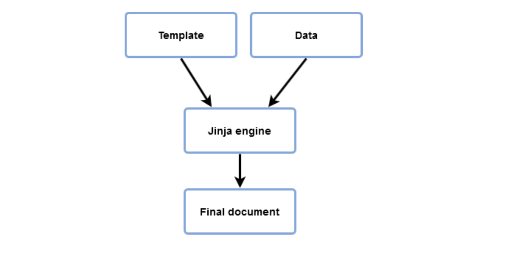

# Jinja Templates
Jinja2 essentially needs two source ingredients, template and data that will be used to render the final document.


## Examples
### Single Variable Substitution
```python
from jinja2 import Template

template = Template("Hello {{ user }}")
data = { "user": "johnny" }
template.render(data)
```

### Multiple Variable Substitution
```python
# source: https://ttl255.com/jinja2-tutorial-part-1-introduction-and-variable-substitution/
from jinja2 import Template

template = """hostname {{ hostname }}

no ip domain lookup
ip domain name local.lab
ip name-server {{ name_server_pri }}
ip name-server {{ name_server_sec }}

ntp server {{ ntp_server_pri }} prefer
ntp server {{ ntp_server_sec }}"""

data = {
    "hostname": "core-sw-waw-01",
    "name_server_pri": "1.1.1.1",
    "name_server_sec": "8.8.8.8",
    "ntp_server_pri": "0.pool.ntp.org",
    "ntp_server_sec": "1.pool.ntp.org",
}

j2_template = Template(template)

print(j2_template.render(data))
```

### Loops

```python
from jinja2 import Template

template = """


Hero: {{ user }}


"""

data = {"users": ["Nikhil", "Rajesh", "Ramesh", "Dilip", "Biraj"]}
j2_template=Template(template)
output = j2_template.render(data)
print(output)
```

### HTML Pages
```python
from jinja2 import Template

HTML="""
<html>
  <title>jinja ninja example</title>
  <body>
    <h2>Welcome Users to Ninja of Jinja</h2>
    <ul>
    
      <li> <a href="{{ user.url }}">{{ user.username }}</a></li>
    
    </ul>
  </body>
</html>
"""

users = { 
  "users": [
    {
      "url": "https://balman.com",
      "username": "balman",
    },
    {
      "url": "https://bikram.com",
      "username": "bikram",
    },
    {
      "url": "https://bibek.com",
      "username": "bibek",
    },
    {
      "url": "https://prashant.com",
      "username": "prashant",
    },
    {
      "url": "https://sahil.com",
      "username": "sahil",
    }
]}


j2_template = Template(HTML)
output=j2_template.render(users)
output=output.replace("\n", "")

# Create html file
file = open("jinja.html", "w")
str_dictionary = repr(output)
file.write(str_dictionary)
file.close()
```

# Filters
## Resources
**Jinja-Builit-In**: https://jinja.palletsprojects.com/en/2.11.x/templates/#builtin-filters

## Examples

### Uppercase
```python
from jinja2 import Template
template = Template("{{ name | upper }}")
template.render(name="JimCarry")
```

### Join
```python
from jinja2 import Template
template = Template("{{ list | join(',')}}")
template.render({"list": [1, 2, 3]})
```

### Max
```python
from jinja2 import Template
template = Template("{{ list | max }}")
template.render({"list": [1, 2, 3]})
```

### Uppercase
```yaml
from jinja2 import Template

template = """


Hero: {{ user | upper() | center() | lower }}


"""

data = {"users": ["Nikhil", "Rajesh", "Ramesh", "Dilip", "Biraj"]}
j2_template=Template(template)
output = j2_template.render(data)
print(output)
```

# Ansible 
## Resources
**Ansible Filters**: https://docs.ansible.com/ansible/2.8/user_guide/playbooks_filters.html

## Examples
### Hello World
```yaml
---
- name: jinja examples
  hosts: all
  vars:
    icon: "Junga Bahadur Rana"
  tasks:
    - name: print the jinja template
      debug:
        msg: "Hello Jinja From Ansible: {{ icon }}"
```

### Loops
```yaml
---
- name: jinja examples
  hosts: all
  tasks:
    - name: print the jinja template
      debug:
        msg: "Jinja Template: {{ item }}"
      with_items:
        - narayan gopal
        - gopal yonjan
        - tara devi
        - nati kaji
        - Phatteman
```

### File Template Example
```yaml
---
- name: jinja file examples
  hosts: all
  vars:
    cname: "devops class !"
  tasks:
    - name: update the default nginx page
      become: yes
      template:
        src: ./default_page.j2
        dest: /var/www/html/index.nginx-debian.html
        owner: root
        group: root
        mode: 0644
      tags:
        - template
    - name: restart nginx
      become: yes
      service:
        name: nginx
        state: restarted
      tags:
        - restart
```